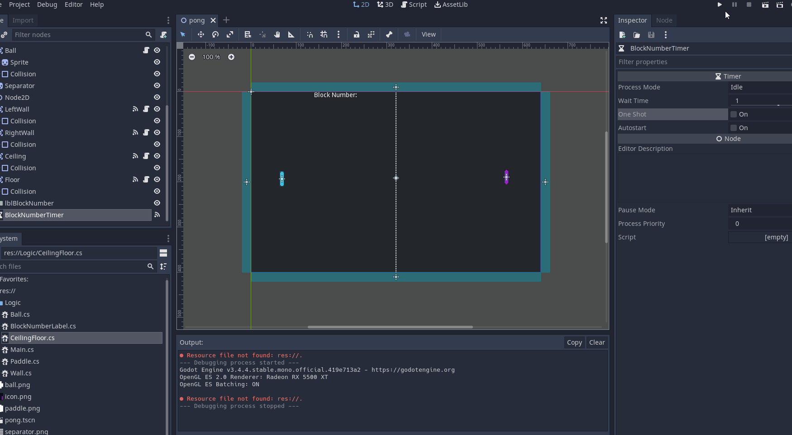

# GoDot Pong with C# with Nethereum Integration

The simple Pong game GoDot demo with Nethereum integration.

This demo demonstrates how to add Nethereum to a game using GoDot.
Check out the original demo on the godot asset library: https://godotengine.org/asset-library/asset/535

## Usage

+ Open the script project in Visual Studio or preferred IDE
+ Add the Nethereum.Web3 Nuget 


## SSL Issues 
 GoDot does not support TLS 1.3 (for example to connect to infura) so these are some workarounds (whilst not secure) to get you developing until then. 
 There are other options to check for root certificates, but suffers similar issues on security as anyone can create a certificate with an issuer.
 
To work with normal Nethereum on your main script add the following

```csharp
 public override async void _Ready()
    {
       ServicePointManager.SecurityProtocol |= SecurityProtocolType.Tls12;
        ServicePointManager.ServerCertificateValidationCallback +=
            (sender, certificate, chain, errors) =>
            {

                if ((errors & (SslPolicyErrors.None)) > 0)
                {
                    return true;
                }

                if (
                    (errors & (SslPolicyErrors.RemoteCertificateNameMismatch)) > 0 ||
                    (errors & (SslPolicyErrors.RemoteCertificateNotAvailable)) > 0
                )
                {
                    return false;
                }

                return true;
            };
        ...

```
# SimpleGoDotRpcClient
A custom Nethereum rpc client can be found in the source code which uses the GoDot HttpClient, this allows to work with http in html
although this also does not support tls 3 and there is not work around as above.

Usage:

```csharp
_simpleRpcClient = new SimpleGoDotRpcClient(new Uri("http://testchain.nethereum.com:8545"), this);
var web3 = new Web3(_simpleRpcClient);
```
# Html Wasm issues and GoDot
GoDot does not support multithreading in Wasm so this is limited to simple request / response. 

## Screenshots




# Full sample Getting block number and displaying on the game

```csharp
using Godot;
using System;
using System.Diagnostics;
using System.Net;
using System.Threading.Tasks;
using Nethereum.Web3;

public class Main : Node2D
{

    private Label blockNumberLabel;

    // Called when the node enters the scene tree for the first time.
    public override async void _Ready()
    {
        ServicePointManager.SecurityProtocol |= SecurityProtocolType.Tls12;
        ServicePointManager.ServerCertificateValidationCallback +=
            (sender, certificate, chain, errors) =>
            {

                if ((errors & (SslPolicyErrors.None)) > 0)
                {
                    return true;
                }

                if (
                    (errors & (SslPolicyErrors.RemoteCertificateNameMismatch)) > 0 ||
                    (errors & (SslPolicyErrors.RemoteCertificateNotAvailable)) > 0
                )
                {
                    return false;
                }

                return true;
            };
        GetNode<Timer>("BlockNumberTimer").Start();
        blockNumberLabel = GetNode<Label>("lblBlockNumber");
        await SetBlockNumber();
    }

    public async void OnBlockNumberTimerTimeout()
    {
        await SetBlockNumber();
    }

    public async Task SetBlockNumber()
    {
        //var web3 = new Web3("https://mainnet.infura.io/v3/yourProjectId");
        //Using localhost testnet
        var web3 = new Web3();
        var blockNumber = await web3.Eth.Blocks.GetBlockNumber.SendRequestAsync();
        blockNumberLabel.Text = "Block Number: " + blockNumber.Value;
    }
}


```

# Thanks
Evrensel Kişilik for first bringing me the attention to GoDot and second for the help in testing the different scenarios to check the ssl certifcates